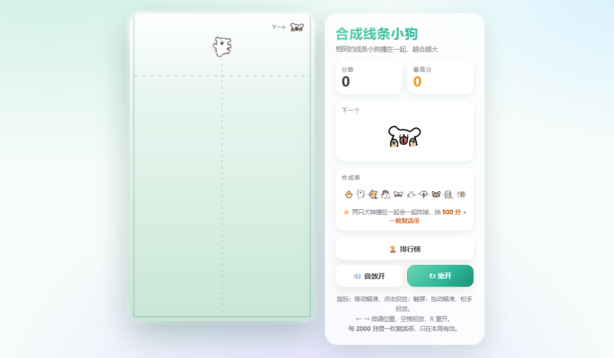
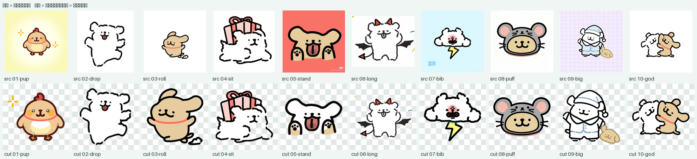

# 合成线条小狗 🐶

一个纯前端的小游戏：拖动瞄准、松手投放，**两只相同的线条小狗撞在一起就合成更大的一只**。

玩法与手感参考了开源项目 [YHSome/BigNaiWa](https://github.com/YHSome/BigNaiWa)（「合成大奶娃」），
美术换成了用户提供的 **10 张线条小狗图**（脚本自动抠图 + 去水印），物理、合成、判负、
复活、排行榜等逻辑沿用并适配原作的管线。

## 预览





## 怎么玩

- **鼠标**：移动瞄准、点击投放；**触屏**：拖动瞄准、松手投放。
- `←` `→` 微调位置，`空格` 投放，`R` 重开。
- 两只一样的小狗撞在一起 → 合成下一级，越大分越高。
- **越线判负**：有小狗停在警戒线上方超过 1.5 秒就结束本局。
- **复活币**：每攒够 **2000 分**发一枚，只在本局有效；越线时可以选择花掉它、清掉警戒线以上的小狗接着玩。
- **犬神清场**：两只**犬神**（最高级）撞在一起会一起炸掉，换 `+500` 分 **外加一枚复活币**。

## 10 级合成链（从小到大）

| 级 | 名字 | 半径 | 出现方式 |
|---|---|---|---|
| 1 | 🐶 小奶狗 | 17 | 会随机投出 |
| 2 | 🐕 垂耳狗 | 23 | 会随机投出 |
| 3 | 🐕 圆滚狗 | 31 | 会随机投出 |
| 4 | 🦮 坐坐狗 | 40 | 会随机投出 |
| 5 | 🐕 站站狗 | 50 | 会随机投出 |
| 6 | 🦴 长腿狗 | 61 | 靠合成 |
| 7 | 🎀 围兜狗 | 73 | 靠合成 |
| 8 | 🧶 毛球狗 | 86 | 靠合成 |
| 9 | 🦸 大块头 | 101 | 靠合成 |
| 10 | 👑 犬神 | 118 | 两只相撞 → 清场 +500 + 复活币 |

> 名字是按「从小到大」的序号临时起的。想改的话，直接改 `game.js` 里 `FRUITS` 表的 `name` 字段。

## 目录

```
index.html            页面结构
style.css             样式（薄荷绿主题）
game.js               游戏主逻辑：物理、合成、渲染、判负、复活
sponsor.js            "请作者喝奶茶"弹窗逻辑
leaderboard.min.js    排行榜（TinyWebDB 静态接口）
physics.test.js       物理手感自检
gameplay.test.js      玩法自检（复活系统 / 犬神清场）
preview.png           游戏预览
preview-cut.png       抠图前后对照（上排原图 / 下排抠好的成品）
assets/dogs/          10 级素材：*.png（抠好的透明原图）、*.webp（运行时用）
                      parts.js（碰撞轮廓，自动生成）
                      blur.js（内联模糊占位图，自动生成）
assets/sponsor-qr.png 微信收款码（赞助弹窗用，纯黑白 640×640）
tools/src/            用户给的原图（01-raw … 10-raw），顺序 = 从小到大
tools/                素材处理脚本
```

## 本地运行

直接双击 `index.html` 就能玩。想用本地服务器（推荐，避免个别浏览器的 file:// 限制）：

```bash
python -m http.server 8080
# 然后打开 http://localhost:8080
```

跑一下自检：

```bash
node physics.test.js
node gameplay.test.js
```

## 素材是怎么来的

原图放在 `tools/src/`，按「从小到大」命名 `01-raw … 10-raw`。
`tools/cutout.py` 会一次性做掉**抠图 + 去水印 + 裁切 + 居中**：

- **抠图**：先从四条边往里做区域生长（只跟「已经判定为背景的邻居」比颜色，所以黄色渐变背景也能吃干净），
  再用这块背景拟合一张平滑的「背景色地图」，按「离背景色多远」判定前景；
  然后把断开的线稿用形态学闭运算接起来、把肚子灌成实心（不然线稿狗会变成空心线框）。
- **去水印**：水印通常离狗很远、颜色又跟背景不一样，所以它既不会被吃进背景、也连不到狗身上 ——
  最后只保留最大的那块 + 离它够近的碎块，水印自然就被扔掉了。

改完原图或者想调参数，跑：

```bash
python tools/cutout.py --preview          # 抠图（--preview 顺便导出 preview-cut.png 对照表）
python tools/optimize_sprites.py          # PNG → WebP（按每级的显示尺寸裁到刚好）
python tools/build_parts.py --grid 3 --min-fill 0.30 --max-parts 18   # 按轮廓生成 parts.js 碰撞箱
python tools/make_blur.py                 # 生成 blur.js 占位图
```

参数含义：

- `--grid`：轮廓采样密度（越小越细，碰撞箱越贴合，但圆更多）。
- `--min-fill`：单个碰撞圆的覆盖率下限。
- `--max-parts`：每只狗最多挂多少个碰撞圆。

当前参数下 10 只狗的轮廓覆盖率约 86%~93%（均值 ~89%），和参考项目的 91% 同一水平。

> `tools/make_dogs.py` 是上一版「用代码画线条小狗」的程序化生成脚本，现在没在用了，
> 留着当备选方案（不依赖任何外部图片）。

## 想改成自己的排行榜

`leaderboard.min.js` 用的是 [TinyWebDB](https://tinywebdb.appinventor.space/) 的免费接口，
现在里面填的还是**参考项目作者的账号**：所有部署了这个游戏的人会**共用同一份榜单**。

想独占榜单，打开 `leaderboard.min.js`，在前 20 行里改这两个变量（值是一层简单的异或字符串，
文件里自带 `_u()` 解码函数，你把想填的明文按同样规则编码回去即可）：

- `_n` → TinyWebDB 用户名
- `_w` → TinyWebDB 密钥

另外榜单的键名前缀也从原作的 `dnw_` 改成了 `ldog_`，昵称默认值改成了「匿名铲屎官」。

## 收款码

赞助弹窗（结算页「☕ 请作者喝杯奶茶」）里已经放好作者的微信收款码 `assets/sponsor-qr.png`，
裁剪 + 去水印后是纯黑白 640×640，扫码或长按识别都行。

想换成自己的：把新收款码裁成正方形（四周留一圈白边）存成同名文件覆盖即可，
也可以直接改 `index.html` 里 `` 的 `src`。

## 部署

纯静态、零依赖，仓库里已经带 `.nojekyll`，随便挑一种方式上线：

- **GitHub Pages**：把整个目录推到仓库的 `main` 分支，仓库 Settings → Pages → Source 选
  `main` / `/(root)`，一两分钟后就能拿到公网链接。
- **Netlify / Vercel**：把文件夹直接拖进它们的网页控制台，或连仓库自动部署。
- **只想自己玩**：见上面的「本地运行」。

> 上线前如果想独占排行榜，先按上一节把 `leaderboard.min.js` 里的账号换成自己的。

## 致谢

- 玩法与整体结构参考：[YHSome/BigNaiWa](https://github.com/YHSome/BigNaiWa)
- 排行榜接口：[TinyWebDB](https://tinywebdb.appinventor.space/)
